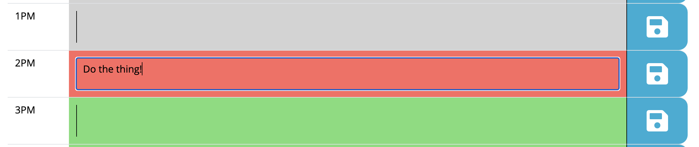

# Work-Day-Scheduler

## Description

This projects creates a simple work day scheduler, maaking it easy to save and remember your tasks throughout the day. 

## Installation

This is a web application and requires no installation.

## Usage

To use this app enter your tasks into each hour and click the save button. Saving your entry allows the task to persist on the page even if you close the tab or refresh the page. 

You can enter whatever text you need as a reminder for each hour in your day. The current hour of the day will be highlighted in red, future hours will be highlighted in green, and hours that have already passed will be gray. 

You can find the live app here: https://llyruss.github.io/Work-Day-Scheduler/

## Credits

I had no collaborators on this project

## License

MIT license

